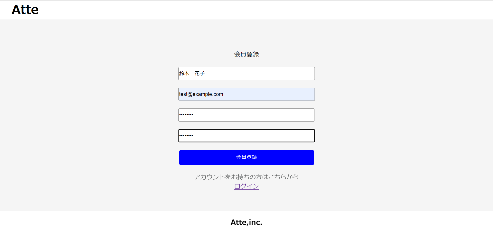
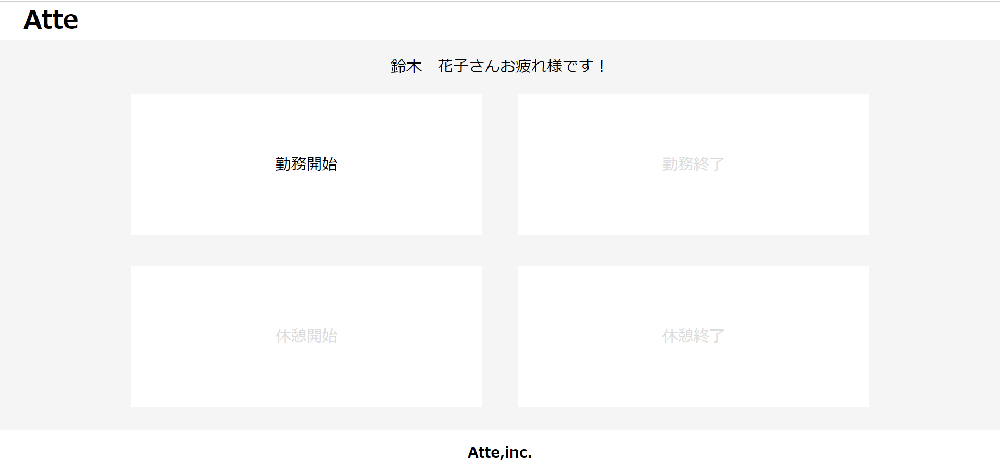
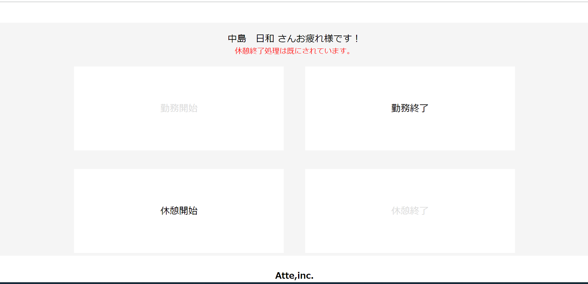
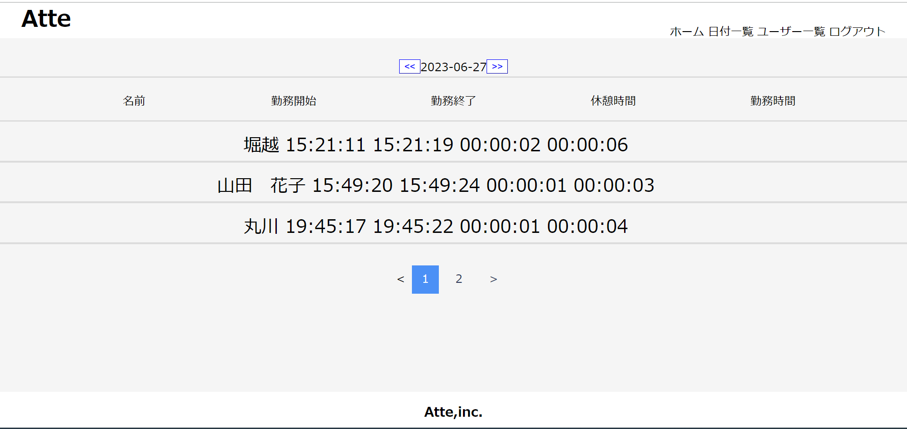
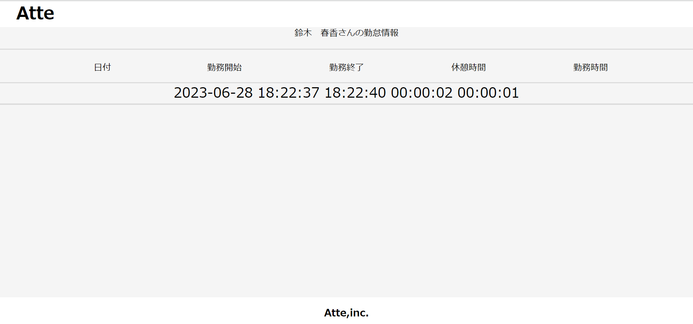
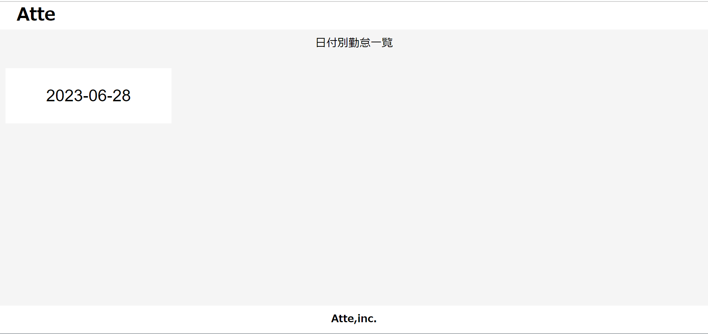
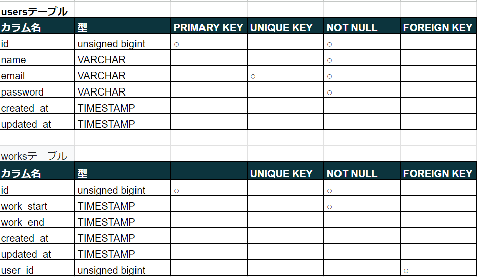
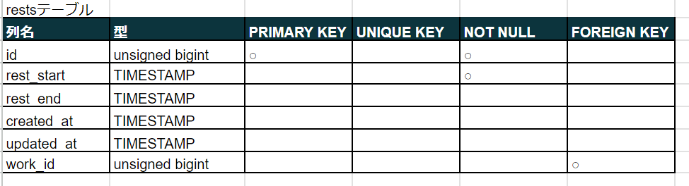
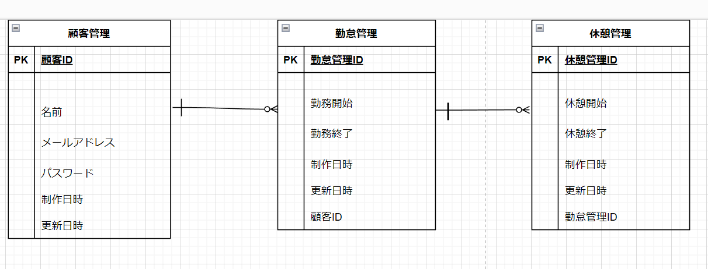

# 勤怠管理アプリ

☆アプリの概要
この勤怠アプリは、勤務者の労働時間、休憩時間を管理できるアプリです。
日付別のページ、ユーザ別のページからの検索も可能です。
ユーザ登録をすれば各個人のデバイスからログイン、打刻、総休憩時間、労働時間の算出ができます。

☆作成した目的
このアプリを用いることで、人事評価における生産性の向上、総時間の算出による労働環境の最適化を可能にします。

☆注意事項
・メール認証の送信が不活性になっております。

☆ほかのリポジトリ
・該当なし

☆機能一覧
・ログイン機能
・勤怠登録ページ
・日付別勤怠ページ
・日付一覧ページ
・ユーザ一覧ページ
・ユーザー別勤怠情報

☆使用技術（実行環境）
laravel 8.83.27
php 7.4.9
mysql

☆テーブル設計

☆ER図

☆環境構築
・localhost:81 使用

